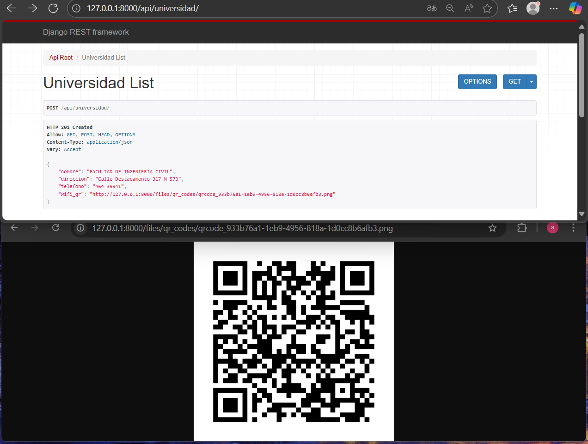

# DRF + QR Codes INTEGRATION.

The integration of Django REST Framework (DRF) with custom fields allows automatic QR code generation from data sent in JSON format.

It uses custom fields from the drf-extra-fields package:

    UrlQRCodeField → generates a QR code from a URL.

    WiFiQRCodeField → generates a QR code with Wi-Fi network credentials.

    vCardQRCodeField → generates a QR code with contact data in vCard format.

This way, the client sends data in JSON format and receives back a resource that includes the QR image in PNG format, ready to use or scan.

# INTEGRATION ARCHITECTURE

The integration follows a typical DRF architecture:

Models (/models.py) → define the data structure, including an ImageField where the generated PNG is stored.

Serializers (/serializers.py) → receive JSON data, validate it, and convert QR fields into PNG images automatically.

Views (/views.py) → expose CRUD endpoints using ModelViewSet.

URLs (/urls.py) → define the routes accessible via API with DefaultRouter.

Settings (/settings.py) → configure where media files are stored (MEDIA_ROOT and MEDIA_URL).

# DETAILED EXPLANATION BY MODULE

* MODELS

```python
class Negocio(models.Model):
    ...
    url_qr = models.ImageField(upload_to='qr_codes/', blank=True, null=True)

class Universidad(models.Model):
    ...
    wifi_qr = models.ImageField(upload_to='qr_codes/', blank=True, null=True)

class Contacto(models.Model):
    ...
    vcard_qr = models.ImageField(upload_to='qr_codes/', blank=True, null=True)

```
    Each model has an ImageField (url_qr, wifi_qr, vcard_qr).

    These fields are not filled manually; they are populated by the serializer when converting the input into a QR code.

    upload_to='qr_codes/' ensures all PNGs are saved inside the files/qr_codes/ folder.

- SERIALIZERS 

```python
class NegocioSerializer(serializers.ModelSerializer):
    url_qr = UrlQRCodeField()

class UniversidadSerializer(serializers.ModelSerializer):
    wifi_qr = WiFiQRCodeField()

class ContactoSerializer(serializers.ModelSerializer):
    vcard_qr = vCardQRCodeField()
```
The serializers do the “magic”:

    1. Validate the received data.

        UrlQRCodeField requires the URL to start with http:// or https://.

        WiFiQRCodeField checks for ssid, password, security, and hidden.

        vCardQRCodeField requires name, phone, and email.

    2. Generate the QR code.

        Internally uses the qrcode library to create a PNG in memory.

    3. Transform it into a file (SimpleUploadedFile).

        This file is assigned to the model’s ImageField.

    4. Save the instance.

        The file is stored physically in MEDIA_ROOT.

- VIEWS

```python
class NegocioViewSet(ModelViewSet):
    queryset = Negocio.objects.all()
    serializer_class = NegocioSerializer
```
    ModelViewSet provides ready-made endpoints (GET, POST, PUT, DELETE).

    On POST → the serializer is executed → the QR is generated → it is saved.

    On GET → the relative URL of the image is returned.

- URLS

```python
router.register(r'negocio', NegocioViewSet, basename='negocio')
router.register(r'universidad', UniversidadViewSet, basename='universidad')
router.register(r'contacto', ContactoViewSet, basename='contacto')
```
Final endpoints:

    /api/business/ → URL QRs.

    /api/university/ → Wi-Fi QRs.

    /api/contact/ → vCard QRs.


- SETTINGS

```python
MEDIA_URL = "/files/"
MEDIA_ROOT = BASE_DIR / "files"
```
    MEDIA_ROOT: actual disk path where PNG files are stored.

    MEDIA_URL: URL used to access those files.

    During development, urls.py uses static() to serve them.

# USAGE EXAMPLES

    When accessing the URL: http://127.0.0.1:8000/api/

    the Django REST Framework browsable interface is displayed.


    On this screen, the endpoints registered in the router appear:

        /api/negocio/ → manage businesses with URL QR codes

        /api/universidad/ → manage universities with Wi-Fi QR codes

        /api/contacto/ → manage contacts with vCard QR codes

 - URL -> QR
 
    Form displayed in the DRF interface before pressing POST.
    Here you enter the business details (name, address, phone) and the URL that will be turned into a QR code.


    Response after pressing POST.
    The same data is returned along with the url_qr field, which now contains the path to the generated PNG file.
    That file is the QR code that can be scanned with a smartphone.


 * WIFI -> QR

   Wi-Fi data is entered: ssid, password, security type (WPA, WEP, or nopass) along with the rest of the university information. This is done before executing the POST.


    After sending the POST, the API returns the saved data plus a wifi_qr field containing the location of the generated PNG.
    When scanned, this QR allows a device to connect automatically to the configured Wi-Fi network.



 * VCARD -> QR

    Contact details are filled in (name, phone, email) along with personal data.
    This screenshot shows the state before sending the POST request.

 

    After the POST, the API returns the complete record with a vcard_qr field.
    This QR contains all the information in vCard format and, when scanned, the phone offers to save the contact directly in the address book. 
    
 


