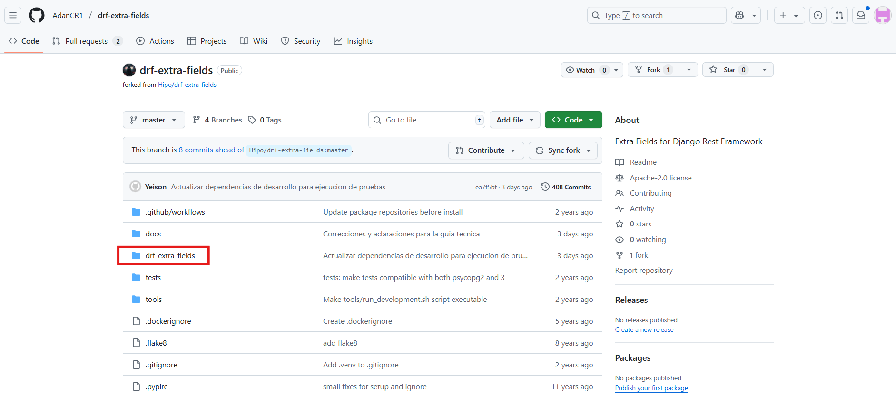
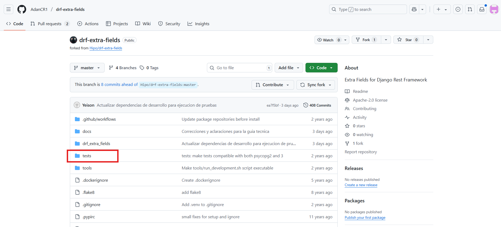
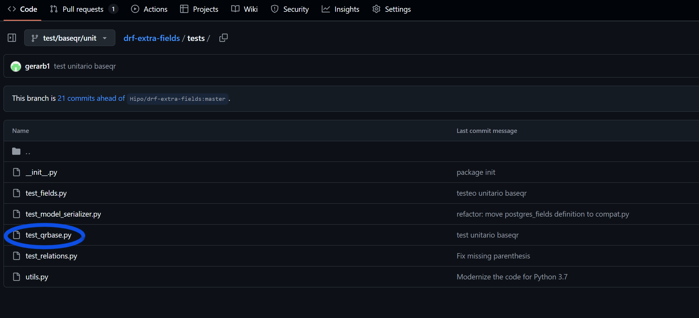
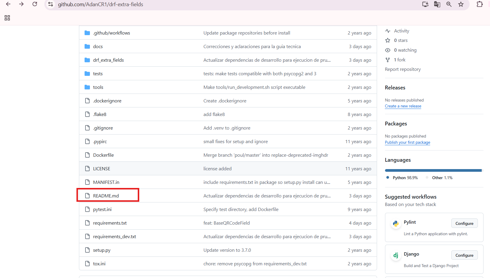
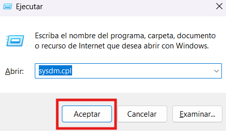
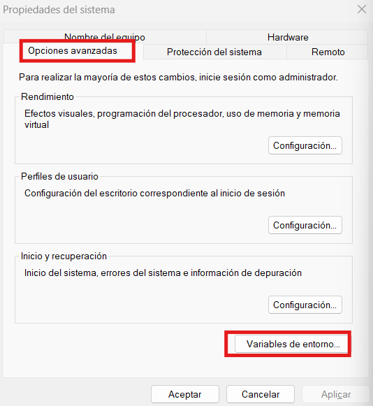
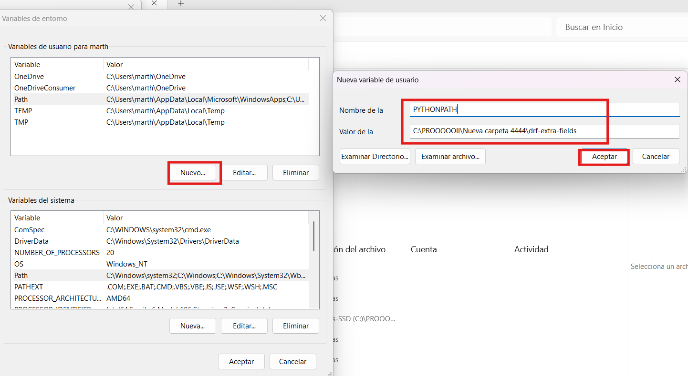
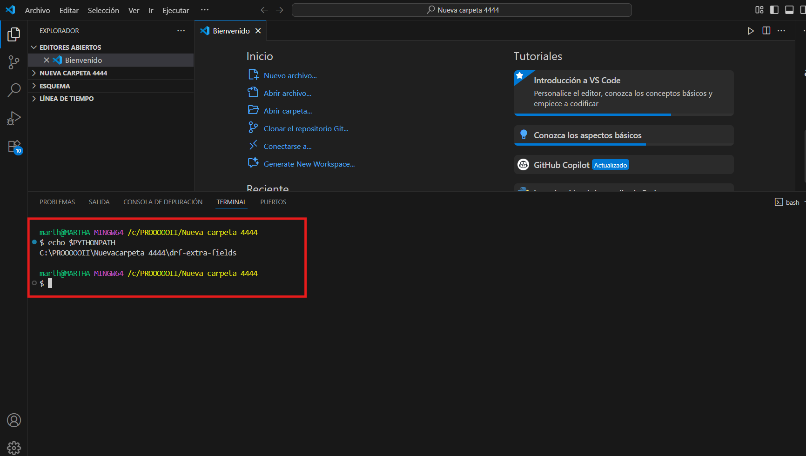
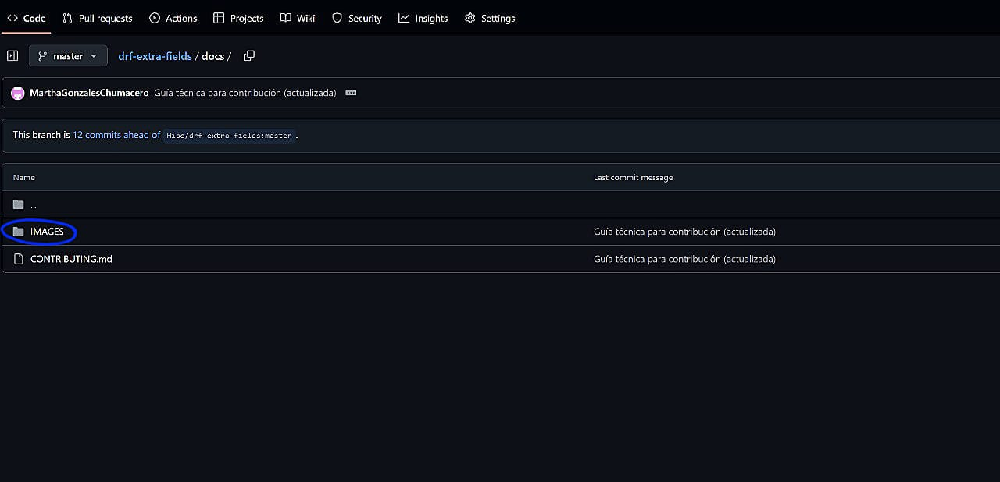

# Guía Técnica para Contribuir en el proyecto drf-extra-fields

Este documento explica desde cómo clonar el repositorio, crear ramas, configurar el entorno de desarrollo, ejecutar pruebas y realizar Pull Requests.
Sigue estos pasos para que tu contribución sea sencilla, efectiva y alineada con las buenas prácticas del proyecto.
---
## 1. Clonar el repositorio (Fork de AdanCr1)

**Este paso es muy importante para la contribución.**

Todos debemos trabajar directamente sobre el fork de AdanCR1, no debes crear tu propio fork.
Ingresa a la pagina de git de AdanCR1, dirígete a la carpeta del proyecto drf-extra-fields (link de referencia https://github.com/AdanCR1/drf-extra-fields) y dale clic en 'Code' para copiar el enlace del repositorio.


Una vez copiado, crea una carpeta y dentro clona el Fork de Adan con el siguiente comando:

```bash
git clone https://github.com/AdanCR1/drf-extra-fields.git
```

## 2. Ingresar al directorio del proyecto

Ingresa al directorio del proyecto para comenzar a trabajar dentro de él con el siguiente comando:

```bash
cd drf-extra-fields
```

## 2.1 Para cambiar de rama ejecuta el siguiente comando

```bash
git checkout nombre-de-tu-rama
```

## 3. Crear y activar el entorno virtual para aislar las dependencias del proyecto

Para crear:

```bash
python -m venv venv
```

Para activar:

- **En Windows:**

  ```bash
  .\venv\Scripts\activate
  ```

- **En macOS/Linux:**

  ```bash
  source venv/bin/activate
  ```

## 4. Instalar dependencias

```bash
pip install -r requirements.txt
```

## 5. Crear una rama de trabajo según tu responsabilidad

Cada integrante del equipo debe crear una rama de trabajo basada en la funcionalidad que le corresponde, por lo que se les asignará un nombre de rama específico que refleje su tarea.
Busquen sus nombres y ejecuten el comando designado para crear su rama de trabajo en el que realizarán sus contribuciones:

- Grupo B - CAMPOS ESPECIALIZADOS

Rama para Mary Villca:
```bash
git checkout -b feature/urlqr/implement
```

Rama para Jorge Choque:
```bash
git checkout -b feature/wifiqr/implement
```

Rama para Celso Velasco:
```bash
git checkout -b feature/vcardqr/implement
```

- Grupo C - TESTING AUTOMATIZADO

Rama para Gerardo Burgos:
```bash
git checkout -b test/baseqr/unit
```

Rama para Rommel Valda:
```bash
git checkout -b test/urlqr/unit
```

Rama para Carlos Marcelo:
```bash
git checkout -b test/wifiqr/unit
```

Rama para Jhony Quispe: 'test/vcardqr/unit'
```bash
git checkout -b test/vcardqr/unit
```

- Grupo D - DOCUMENTACIÓN Y REVISIÓN

Rama para Jhon Escobar:
```bash
git checkout -b docs/redaction/review
```

Rama para Clemente Isla:
```bash
git checkout -b docs/integration-drf/examples
```

Rama para Kevin Navia:
```bash
git checkout -b docs/pull-request/write
```
----

**Directorio para los que van a implementar funciones**
**Tienen que ingresar a los siguientes directorios:**

- Directorio para GRUPO B
Deben de ingresar a la carpeta 'drf_extra_fields' e ingresar al archivo 'fields.py', para para agegar funciones QR personalizadas.



Para los del grupo B, debe existir coordinación con Marshell quien ha creado la clase base que deben extender. 

- Directorio para GRUPO C

Deben de ingresar a la carpeta 'test' e ingresar al archivo 'test_fields.py', para que luego ahí agreguen sus clases de prueba.





Importante establecer que debe existir coordinación entre el grupo B y C ya que las pruebas se harán sobre las funciones creadas.

Las pruebas unitarias deben reflejar los casos de uso y las expectativas definidas en la documentación.

- Para el GRUPO D

Dirigirse simplemente al archivo 'README.md' para realizar los cambios.



Importante instruir que los cambios debe estar ubicado en la parte final del archivo, antes de CONTRIBUTION.

----

**Ejemplo de uso para configuracion del entorno (PYTHONPATH) (grupo b)**

## Configurar PYTHONPATH

Primero, necesitamos asegurarnos de que Python pueda encontrar este módulo si lo usas en otro proyecto. Aquí te explico cómo configurarlo con los siguientes pasos:

**En Windows:**
1. Pulsa `Windows + R`, escribe `sysdm.cpl` y presiona Enter.



2. En la ventana que aparece, ve a la pestaña **Opciones avanzadas** y haz clic en **Variables de entorno**.



3. Busca una variable llamada `PYTHONPATH` en **Variables del sistema**, si ya lo tienes creada sólo editala y pon aceptar y aceptar.



4. Si no la encuentras, crea una nueva con el nombre `PYTHONPATH` y en el valor de esa variable, agrega la ruta completa de tu repositorio, como: `C:\PROOOOOII\Nueva capeta 4444\drf-extra-fields`.



Haz clic en **Aceptar** y cierra todo.

5. Para verificar si has configurado correctamente la variable de entorno `PYTHONPATH`, ejecuta el siguiente comando.

```bash
echo $PYTHONPATH
```
Si esta todo correcto, deberias ver la ruta que as asignado en el valor de `PYTHONPATH`.


---

### **Ejemplo de Implementación del Campo QR:**

1. **Crea el Campo QR:**

En este ejemplo usamos una clase llamada vCardQRCodeField que hereda de BaseQRCodeField.
Lo que hace esta clase es convertir datos de contacto (name, phone, email) en formato vCard y luego generar un código QR en forma de imagen.

Aquí tienes el código de jemplo para probar dentro de un proyecto Django/DRF:

   ```python
   class vCardQRCodeField(BaseQRCodeField):
       """
       Campo que genera un código QR con un diccionario vCard.
       """

       def to_internal_value(self, data):
           if not isinstance(data, dict):
               raise ValidationError("Se esperaba un diccionario para los datos vCard.")

           required_fields = ['name', 'phone', 'email']
           for field in required_fields:
               if field not in data or not data[field]:
                   raise ValidationError(f"Falta o está vacío el campo requerido: '{field}'")

           vcard_string = (
               f"BEGIN:VCARD\n"
               f"VERSION:3.0\n"
               f"FN:{data['name']}\n"
               f"TEL:{data['phone']}\n"
               f"EMAIL:{data['email']}\n"
               f"END:VCARD"
           )

           return super().to_internal_value(vcard_string)
   ```

2. **Modificar el Modelo para Guardar la Imagen del QR:**
   - En el archivo `models.py`, agrega un campo `ImageField` donde se guardará la imagen generada:

   ```python
   codigo_qr = models.ImageField(upload_to="codigos/", null=True, blank=True)
   ```

3. **Configurar los Archivos de Medios:**
   - Para poder guardar y mostrar esas imágenes, configuramos Django para servir archivos multimedia.
   
   **En `settings.py` añadimos:**

   ```python
   MEDIA_URL = "files/"
   MEDIA_ROOT = BASE_DIR / "files"
   ```
    **En `urls.py` agregamos los siguiente:**

 ```bash
   + static(settings.MEDIA_URL, document_root=settings.MEDIA_ROOT)
   ```
Esto ará que en desarrollo podamos ver las imágenes directamente desde el navegador.

---

## **Uso del Campo QR en el Proyecto**

1. **Agregar el Campo al Serializer:**
   - En `serializers.py` usamos nuestro campo especial.

   ```python
   from core.fields import vCardQRCodeField

   class ClienteSerializer(serializers.Serializer):
       contacto_qr = vCardQRCodeField()
   ```
Con esto, cuando llegue la información del cliente, se genera el QR automáticamente.

2. **Levanta el Servidor:**
   - Ejecutamos:

   ```bash
   python manage.py makemigrations
   python manage.py migrate
   python manage.py runserver
   ```

3. **Probar la API**
   - Enviamos un JSON con los datos de un cliente, por ejemplo:

{
  "contacto_qr": {
    "name": "Martha",
    "phone": "77889966",
    "email": "martha@gmail.com"
  }
}

Al hacer la petición, el sistema generará automáticamente el código QR con esos datos.
Finalmente abrimos en el navegador el siguiente enlace http://127.0.0.1:8000/api/nombre-de-la-api/ y listo, ya tenemos disponible el código QR generado con los datos implementados.


---

**Ejemplo de uso para hacer el test (grupo C)**

 Documentación - Test Unitario `BaseQRCodeField`

## Descripción General
Este documento describe el test unitario implementado para la clase `BaseQRCodeField`, un campo personalizado de **Django REST Framework** que genera códigos QR a partir de texto de entrada.

---

##  Estructura del Test
**Archivo:** `test_qrbase.py`  
El test está organizado en una estructura simple y directa que cubre los casos esenciales de uso de la clase `BaseQRCodeField`.

---

##  Dependencias

```python
import pytest
from django.core.files.uploadedfile import SimpleUploadedFile
from django.core.exceptions import ValidationError
from drf_extra_fields.fields import BaseQRCodeField
```

Dependencias Externas Requeridas:

pytest: Framework de testing

Django: Para ValidationError y SimpleUploadedFile

djangorestframework: Framework base

qrcode: Librería para generar códigos QR

pillow: Procesamiento de imágenes

**Componentes del Test**
Fixture: qr_field
```python
@pytest.fixture
def qr_field():
    """Fixture para instanciar la clase BaseQRCodeField."""
    return BaseQRCodeField()
```

Propósito: Proporciona una instancia reutilizable de BaseQRCodeField para todos los tests.
Beneficios:

Evita duplicación de código

Garantiza instancia limpia en cada test

Simplifica la escritura de tests

## Test de Caso Exitoso: test_qrcode_field_valid
```python
def test_qrcode_field_valid(qr_field):
    """Caso exitoso: debe generar un archivo PNG válido cuando se le pasa un string."""
    text = "Hola Gerardo"
    file = qr_field.to_internal_value(text)

    assert isinstance(file, SimpleUploadedFile)
    assert file.content_type == "image/png"
    assert file.name.startswith("qrcode_")
    assert file.name.endswith(".png")
    assert file.size > 0
```
## test de Validación de Tipo: test_qrcode_field_invalid_type
```python
def test_qrcode_field_invalid_type(qr_field):
    with pytest.raises(ValidationError) as exc_info:
        qr_field.to_internal_value(12345)

    assert str(exc_info.value) == "['Expected text to generate QR code']"
```

Objetivo: Rechazar entradas que no sean strings.

Objetivo: Verificar que el campo genere correctamente un código QR válido a partir de texto.

## Test de String Vacío: test_qrcode_field_empty_string
```python 
def test_qrcode_field_empty_string(qr_field):
    with pytest.raises(ValidationError) as exc_info:
        qr_field.to_internal_value("")

    assert str(exc_info.value) == "['Cannot generate QR code from empty text']"
``` 


Objetivo: Rechazar strings vacíos.

## Cobertura de Testing

Casos Cubiertos:

Generación exitosa de QR code

Validación de tipo

Validación de contenido vacío

# Ejecución de Tests
## Ejecutar todos los tests
pytest test_qrbase.py -v

## Ejecutar test específico
pytest test_qrbase.py::test_qrcode_field_valid -v

## Con output detallado
pytest test_qrbase.py -v -s

## Con información de coverage
pytest test_qrbase.py --cov=drf_extra_fields.fields


## Salida Esperada:

test_qrbase.py::test_qrcode_field_valid PASSED           [33%]
test_qrbase.py::test_qrcode_field_invalid_type PASSED    [66%]
test_qrbase.py::test_qrcode_field_empty_string PASSED   [100%]

======================= 3 passed in 0.42s =======================

## Configuración del Entorno

pytest.ini
```python
[pytest]
DJANGO_SETTINGS_MODULE = drf_extra_fields.runtests.settings
testpaths = tests
django_find_project = false
pythonpath = .
python_files = test_*.py *_test.py
```

#    Test Pasando


En el archivo tests/test_qrbase.py deben de crear sus nuevas clases siguiendo el patrón de la clase Base64ImageSerializerTests. La imagen de **test Pasando** es como deberian de lucir sus pruebas.

**Guardar y subir tus cambios**

Haz los cambios que te correspondan en tu rama de trabajo. Luego, ejecuta en la terminal: 'git add .' para agregar los cambios, 'git commit -m "mensaje descriptivo"' para confirmar los cambios y 'git push origin nombre de tu rama', para posteriormente solicitar el Pull Request.

```bash
git add .
git commit -m "mensaje descriptivo"
git push origin nombre-de-tu-rama
```


## 6. Ejecutar y probar tu código localmente

**Ejecutar pruebas con tox**
Para automatizar las pruebas y asegurar la calidad del código, debes usar los siguientes comandos:

```bash
pip install tox
```

```bash
tox
```
**Probar tu código de forma manual**
Puedes crear una archivo temporal para probar tu código, sin tener la necesidad de instalar librerías.

**Ejemplo de uso**
a).- Asegúrate de estar en el entorno virtual y activalo.
b).- Desde la raíz del proyecto (drf-extra-fields), crea un archivo momentaneo nuevo .py para realizar las pruebas.

Si las pruebas fallan, arréglalas y vuelve a ejecutar el comanado hasta que pasen todas correctamente.

## 6.1 Enviar imagen de Validación

En la carpeta `docs/IMAGES`, guarda una captura de pantalla que valide tu implementación.



El nombre del archivo imagen debe ser asi: `Adan_Cap_validacion.jpg`
Primero tu nombre y luego Cap_validacion. Esto con la finalidad de identificar fácilmente la captura de pantalla (OJO, no se aceptará el pull request sin la captura de validacion).
La captura de pantalla debe mostrar claramente la funcionalidad que has implementado o modificado.

## 7. Crear un Pull Request (PR)

1. Ve a: https://github.com/AdanCR1/drf-extra-fields/pulls
2. Haz clic en **"New Pull Request"**
3. Configura así:
   - base: `master`
   - compare: `tu-rama`

Ambas ramas deben ser del repositorio `AdanCR1/drf-extra-fields`.


Completa el formulario del PR:


Y haz clic en **"Create pull request"** para enviar tu contribución a revisión.


## 8. Mantener tu rama actualizada

Ejecuta el siguiente comando periódicamente:

```bash
git pull origin master
```

## Notas

- Asegúrate de estar en el repositorio correcto (`AdanCR1/drf-extra-fields`) al crear el PR.
- Describe claramente los cambios en tu Pull Request, un titulo claro y una descripción breve.
- Ante cualquier duda o consulta, contacta con cualquier miembro del grupo A.