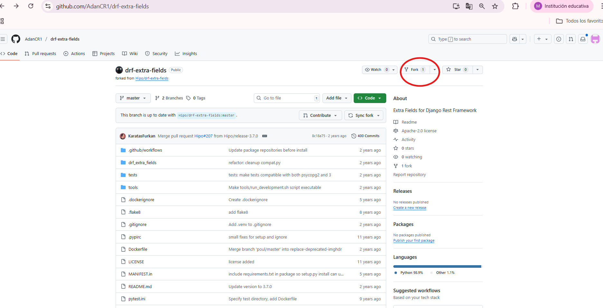
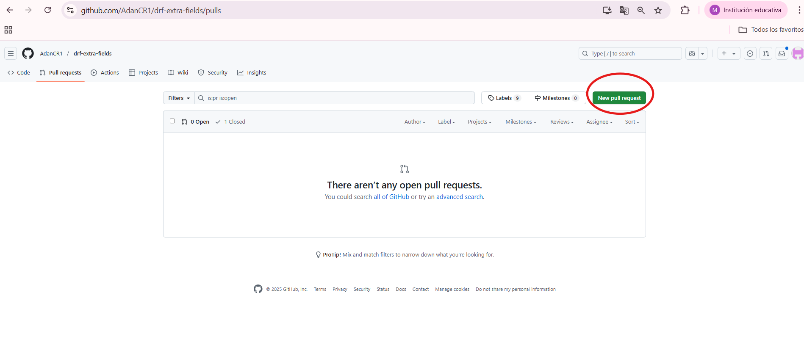
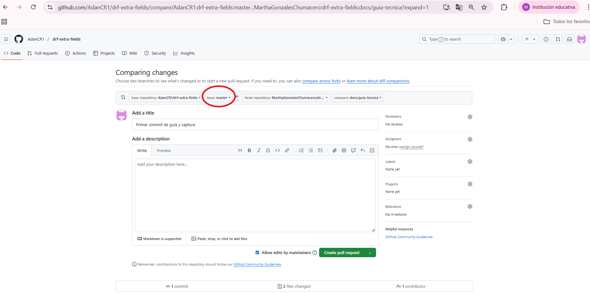

# Guía Técnica para Contribuir en drf-extra-fields

Este documento explica como clonar el repositorio, configurar el entorno de desarrollo, ejecutar pruebas y realizar Pull Requests.
Sigue estos pasos para que tu contribución sea sencilla, efectiva y alineada con las buenas prácticas del proyecto.
---
## 1. Crear y clonar el Fork 

**Este paso es muy importante para la contribucion.**

Ingresa a la pagina de git de AdanCR1, dirijete al proyecto drf-extra-fields (link de referencia https://github.com/AdanCR1/drf-extra-fields) y dale clic en Fork para que se cree el nuevo enlace para tu repositorio.



Una vez creado, crea una carpeta y dentro clona el Fork con el siguiente comando:

```bash
git clone https://github.com/<tu-usuario>/drf-extra-fields.git
```

## 2 Cambiar de directorio en la terminal

```bash
cd drf-extra-fields
```

## 3 Crea una rama de trabajo de acuerdo a tu FUNCIONALIDAD PRINCIPAL 

Para crear y mover una rama ejecuta el siguiente comando:

```bash
git checkout -b docs/guia-tecnica
```
## 4 Ejecutar las  pruebas con tox

Para automatizar las pruebas y asegurar la calidad del código, debes usar los siguientes comandos:

```bash
pip install tox
```

```bash
tox
```

## 5 Pull Request(PR)

- Crea el Pull Request

Desde GitHub de AdanCR1, abre Pull Request (Enlace https://github.com/AdanCR1/drf-extra-fields/pulls), luego dale clic en 'New Pull Requests'.




- Iniciar Pull Request

En la opción **'base'**, asegúrate de que esté seleccionado master.



En la opción **'compare'** debes seleccionar el nombre de tu Rama, , por ejemplo: docs/guia-tecnica.


En la opción **'base repository'**, debe estar seleccionado el repositorio de 'AdanCR1'.


Por último, has clic en **'Create Pull Request'**, esto para que Adan revise tu contribución y nos de un checkout.


## 6 Consejos y buenas practicas

* **Nombres de archivos:** Utiliza los siguientes nombres de Rama para mantener el orden:

- Grupo B - CAMPOS ESPECIALIZADOS

Rama para Mary Villca: 'feature/urlqr/implement'

Rama para Jorge Choque Ferrufino: 'feature/wifiqr/implement'

Rama para Celso Velasco: 'feature/vcardqr/implement'

- Grupo C - TESTING AUTOMATIZADO

Rama para Gerardo Burgos: 'test/baseqr/unit'

Nombre de archivo: 'test_base_qr_code_field.py'

Rama para Rommel Valda: 'test/urlqr/unit'

Rama para Carlos Marcelo: 'test/wifiqr/unit'

Rama para Jhony Quispe: 'test/vcardqr/unit'

- Grupo D - DOCUMENTACIÓN Y REVISIÓN

Rama para Jhon Escobar, Clemente Isla y Kevin Navia:

'docs/integration-drf/examples' y 'docs/pull-request/write'


