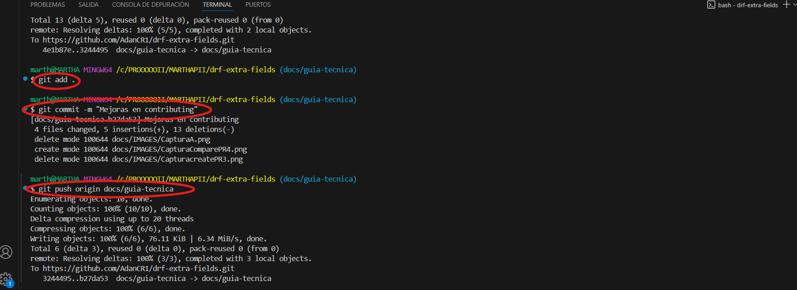
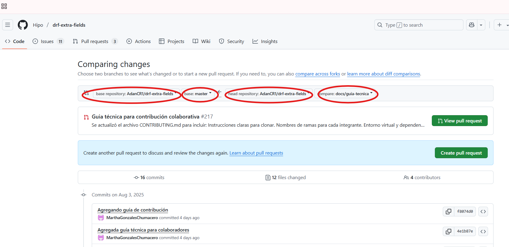
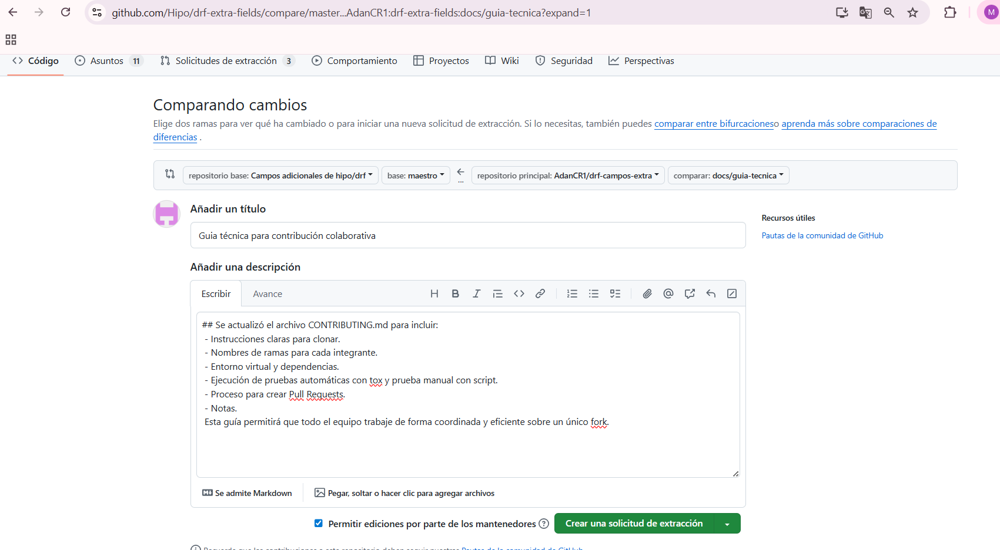

# Guía Técnica para Contribuir en el proyecto drf-extra-fields

Este documento explica desde cómo clonar el repositorio, crear ramas, configurar el entorno de desarrollo, ejecutar pruebas y realizar Pull Requests.
Sigue estos pasos para que tu contribución sea sencilla, efectiva y alineada con las buenas prácticas del proyecto.
---
## 1. Clonar el repositorio (Fork de AdanCr1)

**Este paso es muy importante para la contribución.**

Todos debemos trabajar directamente sobre el fork de AdanCR1, no debes crear tu propio fork.
Ingresa a la pagina de git de AdanCR1, dirígete a la carpeta del proyecto drf-extra-fields (link de referencia https://github.com/AdanCR1/drf-extra-fields) y dale clic en 'Code' para copiar el enlace del repositorio.


Una vez copiado, crea una carpeta y dentro clona el Fork de Adan con el siguiente comando:

```bash
git clone https://github.com/AdanCR1/drf-extra-fields.git
```

## 2. Ingresar al directorio del proyecto

Ingresa al directorio del proyecto para comenzar a trabajar dentro de él con el siguiente comando:

```bash
cd drf-extra-fields
```

## 3. Crear y activar el entorno virtual para aislar las dependencias del proyecto

Para crear:

```bash
python -m venv venv
```

Para activar:

- **En Windows:**

  ```bash
  .\venv\Scripts\activate
  ```

- **En macOS/Linux:**

  ```bash
  source venv/bin/activate
  ```

## 4. Instalar dependencias

```bash
pip install -r requirements.txt
```

## 5. Crear una rama de trabajo según tu responsabilidad

Cada integrante del equipo debe crear una rama basada en su funcionalidad asignada. Usa el comando correspondiente:

### Grupo B - CAMPOS ESPECIALIZADOS

- **Mary Villca**  
```bash
git checkout -b feature/urlqr/implement
```

- **Jorge Choque**  
```bash
git checkout -b feature/wifiqr/implement
```

- **Celso Velasco**  
```bash
git checkout -b feature/vcardqr/implement
```

### Grupo C - TESTING AUTOMATIZADO

- **Gerardo Burgos**  
```bash
git checkout -b test/baseqr/unit
```

- **Rommel Valda**  
```bash
git checkout -b test/urlqr/unit
```

- **Carlos Marcelo**  
```bash
git checkout -b test/wifiqr/unit
```

- **Jhony Quispe**  
```bash
git checkout -b test/vcardqr/unit
```

### Grupo D - DOCUMENTACIÓN Y REVISIÓN

- **Jhon Escobar**  
```bash
git checkout -b docs/redaction/review
```

- **Clemente Isla**  
```bash
git checkout -b docs/integration-drf/examples
```

- **Kevin Navia**  
```bash
git checkout -b docs/pull-request/write
```

Luego realiza tus cambios y usa los siguientes comandos:

```bash
git add .
git commit -m "mensaje descriptivo"
git push origin nombre-de-tu-rama
```



## 6. Ejecutar y probar tu código localmente

### Ejecutar pruebas con tox

```bash
pip install tox
tox
```

### Probar manualmente

Crea un archivo temporal llamado `probar_urlqr.py` y agrega el siguiente código:

```python
from drf_extra_fields.fields.url_qr_field import URLQRField

campo = URLQRField()
valor = campo.to_representation("https://github.com/AdanCR1")

print("Resultado del campo URLQRField:")
print(valor)
```

Ejecuta el archivo con:

```bash
python probar_urlqr.py
```

Corrige los errores si es necesario y vuelve a probar.

## 7. Crear un Pull Request (PR)

1. Ve a: https://github.com/AdanCR1/drf-extra-fields/pulls
2. Haz clic en **"New Pull Request"**
3. Configura así:
   - base: `maestro`
   - compare: `tu-rama`

Ambas ramas deben ser del repositorio `AdanCR1/drf-extra-fields`.



Completa el formulario del PR:



Y haz clic en **"Create pull request"** para enviar tu contribución a revisión.


## 8. Mantener tu rama actualizada

Ejecuta el siguiente comando periódicamente:

```bash
git pull origin maestro
```

## Notas

- Asegúrate de estar en el repositorio correcto (`AdanCR1/drf-extra-fields`) al crear el PR.
- Describe claramente los cambios en tu Pull Request.