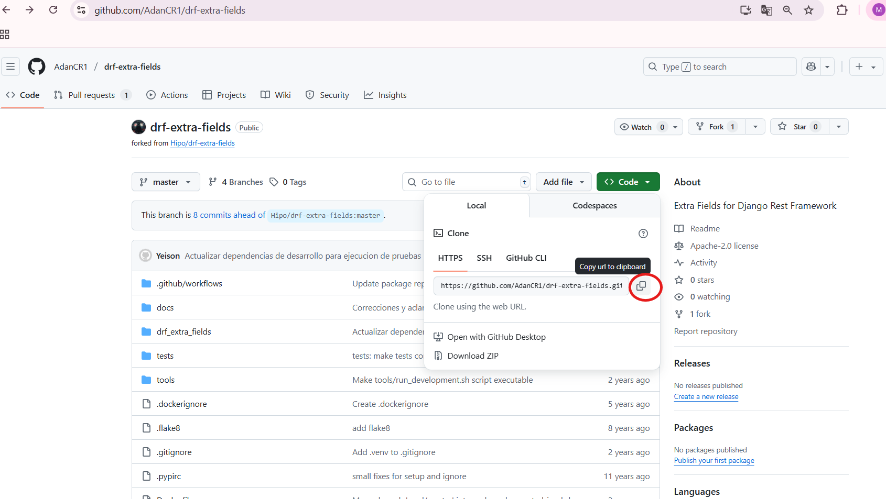
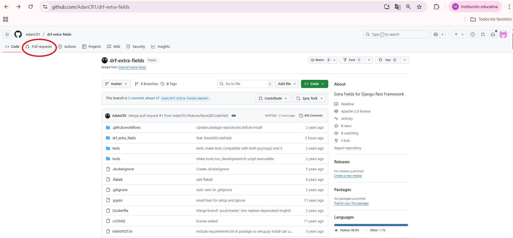
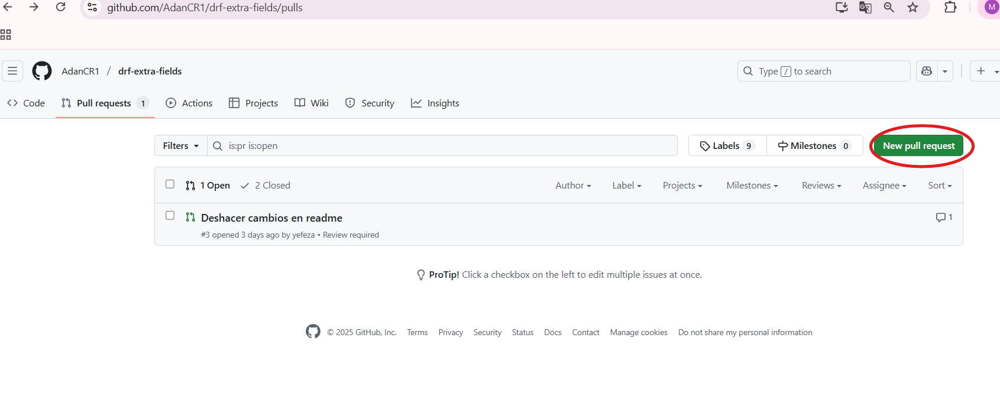
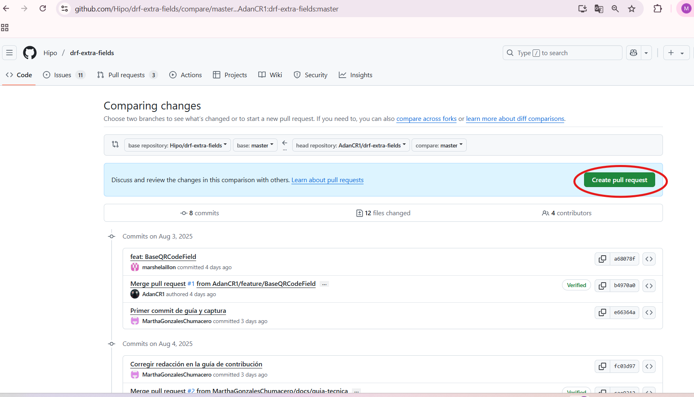
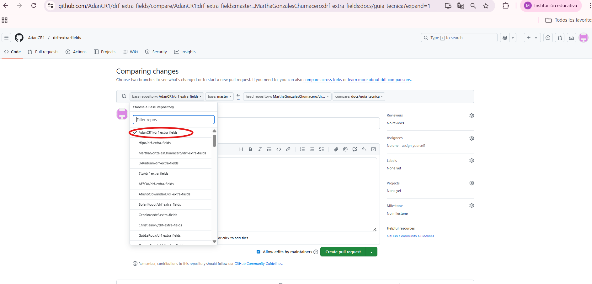
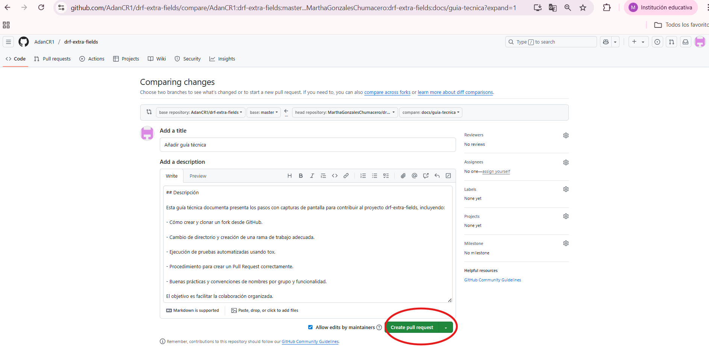

# Guía Técnica para Contribuir en drf-extra-fields

Este documento explica desde cómo clonar el repositorio, ramas, configurar el entorno de desarrollo, ejecutar pruebas y realizar Pull Requests.
Sigue estos pasos para que tu contribución sea sencilla, efectiva y alineada con las buenas prácticas del proyecto.
---
## 1. Clonar el repositorio

**Este paso es muy importante para la contribucion.**

Ingresa a la pagina de git de AdanCR1, dirijete al proyecto drf-extra-fields (link de referencia https://github.com/AdanCR1/drf-extra-fields) y dale clic en 'Code' para copiar el enlace del repositorio.



Una vez copiado, crea una carpeta y dentro clona el Fork de Adan con el siguiente comando:

```bash
git clone https://github.com/AdanCR1/drf-extra-fields.git
```
## 2 Ingresa al directorio del proyecto

Ingresa a la carpeta del proyecto para comenzar a trabajar dentro de ella con el siguiente comando.

```bash
cd drf-extra-fields
```

## 3 Crear y activar el entorno virtual para que aisle las dependencias del proyecto

Para crear:

```bash
python -m venv venv
```

Para activar:

- **En Windows:**

  ```bash
  .\venv\Scripts\activate
  ```

- **En macOS/Linux:**

  ```bash
  source venv/bin/activate
  ```
## 4. Instalar dependencias

```bash
pip install -r requirements.txt
```

## 5. Crea una rama de trabajo de acuerdo a tu FUNCIONALIDAD PRINCIPAL 

Cada integrante del equipo debe crear una rama de trabajo basada en la funcionalidad que le corresponde, por lo que se les asignara un nombre de rama específico que refleje su tarea.
Busquen sus nombres y ejecuten el comando designado para crear su rama de trabajo en el que realizarán sus contribuciones:

- Grupo B - CAMPOS ESPECIALIZADOS

Rama para Mary Villca:
```bash
git checkout -b feature/urlqr/implement
```

Rama para Jorge Choque:
```bash
git checkout -b feature/wifiqr/implement
```

Rama para Celso Velasco:
```bash
git checkout -b feature/vcardqr/implement
```

- Grupo C - TESTING AUTOMATIZADO

Rama para Gerardo Burgos:
```bash
git checkout -b test/baseqr/unit
```

Rama para Rommel Valda:
```bash
git checkout -b test/urlqr/unit
```

Rama para Carlos Marcelo:
```bash
git checkout -b test/wifiqr/unit
```

Rama para Jhony Quispe: 'test/vcardqr/unit'
```bash
git checkout -b test/vcardqr/unit
```

- Grupo D - DOCUMENTACIÓN Y REVISIÓN

Rama para Jhon Escobar:
```bash
git checkout -b docs/redaction/review
```

Rama para Clemente Isla:
```bash
git checkout -b docs/integration-drf/examples
```

Rama para Kevin Navia:
```bash
git checkout -b docs/pull-request/write
```

----

Haz los cambios que te correspondan en tu rama de trabajo. Luego, ejecuta 'git add .' para agregar los cambios y 'git commit -m "mensaje descriptivo"' para confirmar los cambios, posteriormente ya estará listo para solicitar el Pull Request.

## 4. Ejecutar las  pruebas con tox

Para automatizar las pruebas y asegurar la calidad del código, debes usar los siguientes comandos:

```bash
pip install tox
```

```bash
tox
```

Si las prueban fallan, areglalo y vuelve a ejectutar hasta que pase.

## 5. Pull Request(PR)

Si estás seguro de que tu rama de trabajo está lista para ser revisada, sigue estos pasos:

- Crea el Pull Request

Desde GitHub de AdanCR1, abre Pull Request (Enlace https://github.com/AdanCR1/drf-extra-fields/pulls), luego dale clic en 'New Pull Requests'.





- Crea el Pull Request

GitHub detectará aumtomáticamente que has subido una nueva rama y mostrará un botón que dice 'Create pull request'.



Dale clic en el botón y redacta el Pull Request, por ejemplo: docs/guia-tecnica.


En la opción **'base repository'**, debe estar seleccionado el repositorio de 'AdanCR1'.



Por último, has clic en **'Create Pull Request'**, esto para que Adan revise tu contribución y nos de un checkout.



### Notas:
- Asegúrate de estar en el repositorio correcto (AdanCR1/drf-extra-fields) al crear el Pull Request y no en tu fork.
- Asegúrate de que tu Pull Request sea claro y conciso, describiendo los cambios realizados y su propósito.