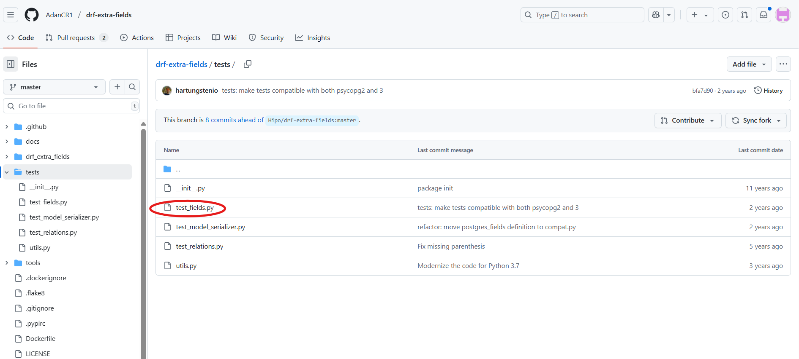

# Guía Técnica para Contribuir en el proyecto drf-extra-fields

Este documento explica desde cómo clonar el repositorio, crear ramas, configurar el entorno de desarrollo, ejecutar pruebas y realizar Pull Requests.
Sigue estos pasos para que tu contribución sea sencilla, efectiva y alineada con las buenas prácticas del proyecto.
---
## 1. Clonar el repositorio (Fork de AdanCr1)

**Este paso es muy importante para la contribución.**

Todos debemos trabajar directamente sobre el fork de AdanCR1, no debes crear tu propio fork.
Ingresa a la pagina de git de AdanCR1, dirígete a la carpeta del proyecto drf-extra-fields (link de referencia https://github.com/AdanCR1/drf-extra-fields) y dale clic en 'Code' para copiar el enlace del repositorio.


Una vez copiado, crea una carpeta y dentro clona el Fork de Adan con el siguiente comando:

```bash
git clone https://github.com/AdanCR1/drf-extra-fields.git
```

## 2. Ingresar al directorio del proyecto

Ingresa al directorio del proyecto para comenzar a trabajar dentro de él con el siguiente comando:

```bash
cd drf-extra-fields
```

## 3. Crear y activar el entorno virtual para aislar las dependencias del proyecto

Para crear:

```bash
python -m venv venv
```

Para activar:

- **En Windows:**

  ```bash
  .\venv\Scripts\activate
  ```

- **En macOS/Linux:**

  ```bash
  source venv/bin/activate
  ```

## 4. Instalar dependencias

```bash
pip install -r requirements.txt
```

## 5. Crear una rama de trabajo según tu responsabilidad

Cada integrante del equipo debe crear una rama de trabajo basada en la funcionalidad que le corresponde, por lo que se les asignará un nombre de rama específico que refleje su tarea.
Busquen sus nombres y ejecuten el comando designado para crear su rama de trabajo en el que realizarán sus contribuciones:

- Grupo B - CAMPOS ESPECIALIZADOS

Rama para Mary Villca:
```bash
git checkout -b feature/urlqr/implement
```

Rama para Jorge Choque:
```bash
git checkout -b feature/wifiqr/implement
```

Rama para Celso Velasco:
```bash
git checkout -b feature/vcardqr/implement
```

- Grupo C - TESTING AUTOMATIZADO

Rama para Gerardo Burgos:
```bash
git checkout -b test/baseqr/unit
```

Rama para Rommel Valda:
```bash
git checkout -b test/urlqr/unit
```

Rama para Carlos Marcelo:
```bash
git checkout -b test/wifiqr/unit
```

Rama para Jhony Quispe: 'test/vcardqr/unit'
```bash
git checkout -b test/vcardqr/unit
```

- Grupo D - DOCUMENTACIÓN Y REVISIÓN

Rama para Jhon Escobar:
```bash
git checkout -b docs/redaction/review
```

Rama para Clemente Isla:
```bash
git checkout -b docs/integration-drf/examples
```

Rama para Kevin Navia:
```bash
git checkout -b docs/pull-request/write
```
----

**Directorio para los que van a implementar funciones**
**Tienen que ingresar a los siguientes directorios:**

- Directorio para GRUPO B
Deben de ingresar a la carpeta 'drf_extra_fields' e ingresar al archivo 'fields.py', para para agegar funciones QR personalizadas.


Para los del grupo B, debe existir coordinación con Marshell quien ha creado la clase base que deben extender. 

- Directorio para GRUPO C

Deben de ingresar a la carpeta 'test' e ingresar al archivo 'test_fields.py', para que luego ahí agreguen sus clases de prueba.




Importante establecer que debe existir coordinación entre el grupo B y C ya que las pruebas se harán sobre las funciones creadas. 

- Para el GRUPO D

Dirigirse simplemente al archivo 'README.md' para realizar los cambios.


Importante instruir que los cambios debe estar ubicado en la parte final del archivo, antes de CONTRIBUTION.

**Ejemplo de uso para hacer el test (grupo C)**

```python
from drf_extra_fields.fields import UrlQRCodeField
from rest_framework import serializers
from django.test import TestCase
from django.core.exceptions import ValidationError


class UrlQRCodeSerializer(serializers.Serializer):
    url = UrlQRCodeField()


class UrlQRCodeFieldTests(TestCase):
    def test_valid_url(self):
        data = {'url': 'https://example.com'}
        serializer = UrlQRCodeSerializer(data=data)
        self.assertTrue(serializer.is_valid(), serializer.errors)
        self.assertEqual(serializer.validated_data['url'], data['url'])

    def test_invalid_url(self):
        data = {'url': 'not-a-valid-url'}
        serializer = UrlQRCodeSerializer(data=data)
        self.assertFalse(serializer.is_valid())
        self.assertIn('url', serializer.errors)

    def test_blank_url(self):
        data = {'url': ''}
        serializer = UrlQRCodeSerializer(data=data)
        self.assertFalse(serializer.is_valid())
        self.assertIn('url', serializer.errors)
```

Este ejemplo está generado con IA siguiendo el patrón de la clase Base64ImageSerializerTests. Por lo que se recomienda que tomen una parte del codigo del archivo tests/test_fields.py como ejemplo, sigan el mismo enfoque y lo adapten a sus necesidades.

En el archivo tests/test_fields.py. deben de crear sus nuevas clases siguiendo el patrón de la clase Base64ImageSerializerTests.

**Guardar y subir tus cambios**

Haz los cambios que te correspondan en tu rama de trabajo. Luego, ejecuta en la terminal: 'git add .' para agregar los cambios, 'git commit -m "mensaje descriptivo"' para confirmar los cambios y 'git push origin nombre de tu rama', para posteriormente solicitar el Pull Request.

```bash
git add .
git commit -m "mensaje descriptivo"
git push origin nombre-de-tu-rama
```


## 6. Ejecutar y probar tu código localmente

**Ejecutar pruebas con tox**
Para automatizar las pruebas y asegurar la calidad del código, debes usar los siguientes comandos:

```bash
pip install tox
```

```bash
tox
```
**Probar tu código de forma manual**
Puedes crear una archivo temporal para probar tu código, sin tener la necesidad de instalar librerías.

**Ejemplo de uso**
a).- Asegúrate de estar en el entorno virtual y activalo.
b).- Desde la raíz del proyecto (drf-extra-fields), crea un archivo momentaneo nuevo .py para realizar las pruebas.

Si las pruebas fallan, arréglalas y vuelve a ejecutar el comanado hasta que pasen todas correctamente.

## 6.1 Enviar imagen de Validación

En la carpeta `docs/IMAGES`, guarda una captura de pantalla que valide tu implementación.


El nombre del archivo imagen debe ser asi: `Adan_Cap_validacion.jpg`
Primero tu nombre y luego Cap_validacion. Esto con la finalidad de identificar fácilmente la captura de pantalla (OJO, no se aceptará el pull request sin la captura de validacion).
La captura de pantalla debe mostrar claramente la funcionalidad que has implementado o modificado.

## 7. Crear un Pull Request (PR)

1. Ve a: https://github.com/AdanCR1/drf-extra-fields/pulls
2. Haz clic en **"New Pull Request"**
3. Configura así:
   - base: `master`
   - compare: `tu-rama`

Ambas ramas deben ser del repositorio `AdanCR1/drf-extra-fields`.


Completa el formulario del PR:


Y haz clic en **"Create pull request"** para enviar tu contribución a revisión.


## 8. Mantener tu rama actualizada

Ejecuta el siguiente comando periódicamente:

```bash
git pull origin master
```

## Notas

- Asegúrate de estar en el repositorio correcto (`AdanCR1/drf-extra-fields`) al crear el PR.
- Describe claramente los cambios en tu Pull Request, un titulo claro y una descripción breve.
- Ante cualquier duda o consulta, contacta con cualquier miembro del grupo A.