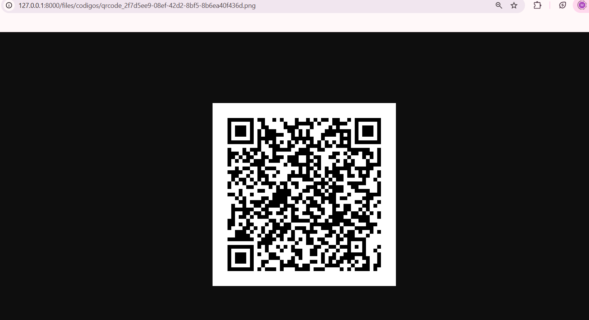

# Technical Guide for Contributing to the drf-extra-fields Project

This document explains how to clone the repository, create branches, set up the development environment, run tests, and make Pull Requests. Follow these steps to make your contribution simple, effective, and aligned with the project's best practices.

---

---

# **How to Set Up Your Development Environment**

## 1. Fork and Clone the Repository

**This step is very important for contributing.**

Create a Fork of the original repository in your GitHub account. This will allow you to work on your own copy of the project without affecting the main repository. Go to your fork's page and click on 'Code' to copy the repository link.


Once copied, create a folder and inside clone your Fork with the following command:

```bash
git clone https://github.com/[username]/drf-extra-fields.git
```

## 2. Enter the Project Directory

Enter the project directory to start working inside it with the following command:

```bash
cd drf-extra-fields
```

## 2.1 Create a Development Branch from Master with the Name of the Feature or Task Assigned to You (Optional)

```bash
git checkout -b your-branch-name
```

## 3. Create and Activate the Virtual Environment to Isolate Project Dependencies

To create:

```bash
python -m venv venv
```

To activate:

- **On Windows:**

  ```bash
  .\venv\Scripts\activate
  ```

- **On macOS/Linux:**

  ```bash
  source venv/bin/activate
  ```

## 4. Install Dependencies

```bash
pip install -r requirements_dev.txt
```

**How to Test Your Implementation - Example Usage for Environment Configuration (PYTHONPATH)**

## 5. Configure PYTHONPATH

First, we need to make sure that Python can find this module if you use it in another project. Here I explain how to configure it with the following steps:

**On Windows:**

1. Press `Windows + R`, type `sysdm.cpl` and press Enter.


2. In the window that appears, go to the **Advanced** tab and click on **Environment Variables**.


3. Look for a variable called `PYTHONPATH` in **System Variables**. If you already have it created, just edit it and click OK and OK.

4. If you don't find it, create a new one named `PYTHONPATH` and in the value of that variable, add the full path to your repository, such as: `C:\Users\Martha\Documents\drf-extra-fields`.


Click **OK** and close everything.

5. To verify if you have correctly configured the `PYTHONPATH` environment variable, run the following command.

```bash
echo $PYTHONPATH
```

If everything is correct, you should see the path you assigned in the value of `PYTHONPATH`.


Note: With the `PYTHONPATH` environment variable configured, Python will be able to find the `drf_extra_fields` module from any project you are working on. This is useful if you want to use the implemented fields in a test project or another project without having to install it as a package.

---

# **How to Implement a Custom Field: Example with QR Codes**

This is an example of how to implement a custom field for QR code generation and how to use it in a real implementation with Django/DRF.

## 1. Create the QR Field:

In this example, we use a class called vCardQRCodeField that inherits from BaseQRCodeField. What this class does is convert contact data (name, phone, email) into vCard format and then generate a QR code as an image, implemented in the file `drf_extra_fields/fields.py`.

```python
class vCardQRCodeField(BaseQRCodeField):
    """
    Field that generates a QR code with a vCard dictionary.
    """

    def to_internal_value(self, data):
        if not isinstance(data, dict):
            raise ValidationError("A dictionary was expected for vCard data.")

        required_fields = ['name', 'phone', 'email']
        for field in required_fields:
            if field not in data or not data[field]:
                raise ValidationError(f"Missing or empty required field: '{field}'")

        vcard_string = (
            f"BEGIN:VCARD\n"
            f"VERSION:3.0\n"
            f"FN:{data['name']}\n"
            f"TEL:{data['phone']}\n"
            f"EMAIL:{data['email']}\n"
            f"END:VCARD"
        )

        return super().to_internal_value(vcard_string)
```

## 2. Create a Django Project to Test the QR Field:

- Create a Django project and an app called `core`.

```bash
django-admin startproject my_project
cd my_project
python manage.py startapp core
```

## 3. Create a Model to Save the QR Image:

- In the file `core/models.py`, add an `ImageField` where the generated image will be saved:

```python
codigo_qr = models.ImageField(upload_to="codigos/", null=True, blank=True)
```

## 4. Configure Media Files:

- To be able to save and display the generated QR code images, configure Django to serve media files.

**In `settings.py` add:**

```python
MEDIA_URL = "files/"
MEDIA_ROOT = BASE_DIR / "files"
```

**In `urls.py` add the following:**

```bash
  + static(settings.MEDIA_URL, document_root=settings.MEDIA_ROOT)
```

This will allow you to view the images directly from the browser during development.

## 5. Add the Field to the Serializer:

- In `serializers.py` use our special field.

```python
from core.fields import vCardQRCodeField

class ClienteSerializer(serializers.Serializer):
    codigo_qr = vCardQRCodeField()
```

With this, when the client's information arrives, the QR is generated automatically.

## 6. Start the Server:

- Run:

```bash
python manage.py makemigrations
python manage.py migrate
python manage.py runserver
```

## 7. Test the API

- Send a JSON with the client's data, for example:

{ "contacto_qr": { "name": "Martha", "phone": "77889966", "email": "martha@gmail.com" } }

When making the request, the system will automatically generate the QR code with that data. Finally, open the following link in your browser http://127.0.0.1:8000/api/api-name/ and that's it, you now have the QR code generated with the implemented data available.

## 

---

# **How to Write Unit Tests for Your Custom Field**

This document describes as an example the unit test implemented for the `BaseQRCodeField` class, a custom field of **Django REST Framework** that generates QR codes from input text.

---

## 1. Test Structure

**File:** `test_qrbase.py`  
The test is organized in a simple and direct structure that covers the essential use cases of the `BaseQRCodeField` class.

---

## 2. Dependencies

```python
import pytest
from django.core.files.uploadedfile import SimpleUploadedFile
from django.core.exceptions import ValidationError
from drf_extra_fields.fields import BaseQRCodeField
```

Required External Dependencies:

pytest: Testing framework

Django: For ValidationError and SimpleUploadedFile

djangorestframework: Base framework

qrcode: Library to generate QR codes

pillow: Image processing

## 3. **Test Components** Fixture: qr_field

```python
@pytest.fixture
def qr_field():
    """Fixture to instantiate the BaseQRCodeField class."""
    return BaseQRCodeField()
```

Purpose: Provides a reusable instance of BaseQRCodeField for all tests. Benefits:

Avoids code duplication

Ensures a clean instance in each test

Simplifies writing tests

## 4. Successful Case Test: test_qrcode_field_valid

```python
def test_qrcode_field_valid(qr_field):
    """Successful case: should generate a valid PNG file when given a string."""
    text = "Hola Gerardo"
    file = qr_field.to_internal_value(text)

    assert isinstance(file, SimpleUploadedFile)
    assert file.content_type == "image/png"
    assert file.name.startswith("qrcode_")
    assert file.name.endswith(".png")
    assert file.size > 0
```

## 5. Type Validation Test: test_qrcode_field_invalid_type

```python
def test_qrcode_field_invalid_type(qr_field):
    with pytest.raises(ValidationError) as exc_info:
        qr_field.to_internal_value(12345)

    assert str(exc_info.value) == "['Expected text to generate QR code']"
```

Objective: Reject inputs that are not strings.

Objective: Verify that the field correctly generates a valid QR code from text.

## 6. Empty String Test: test_qrcode_field_empty_string

```python
def test_qrcode_field_empty_string(qr_field):
    with pytest.raises(ValidationError) as exc_info:
        qr_field.to_internal_value("")

    assert str(exc_info.value) == "['Cannot generate QR code from empty text']"
```

Objective: Reject empty strings.

## 7. Running Tests

Run all tests

```bash
pytest test_qrbase.py -v
```

Run a specific test

```bash
pytest test_qrbase.py::test_qrcode_field_valid -v
```

With detailed output

```bash
pytest test_qrbase.py -v -s
```

With coverage information

```bash
pytest test_qrbase.py --cov=drf_extra_fields.fields
```

Expected Output:

```bash
test_qrbase.py::test_qrcode_field_valid PASSED [33%]
test_qrbase.py::test_qrcode_field_invalid_type PASSED [66%]
test_qrbase.py::test_qrcode_field_empty_string PASSED [100%]
======================= 3 passed in 0.42s =======================

```

Passing Test


In the file tests/test_qrbase.py you should create your new classes following the pattern of the Base64ImageSerializerTests class. The **Passing Test** image is how your tests should look.

## 8. **Run tests with tox** To automate tests and ensure code quality

you should use the following commands:

```bash
pip install tox
```

```bash
tox
```

---

# **How to Submit Your Changes for Review**

1. Go to: https://github.com/Hipo/drf-extra-fields/pulls
2. Click on **"New Pull Request"**
3. Set up as follows:
   - base: `master` repository `Hipo/drf-extra-fields`
   - compare: `your-branch` repository `your-username/drf-extra-fields`
4. Review the changes and make sure everything is correct.
5. Add a descriptive title and a detailed description of your changes, indicating what problem they solve or what functionality they add.
6. Click **"Create pull request"** to submit your contribution for review.

## Notes

- Clearly describe the changes in your Pull Request, with a clear title and a brief
